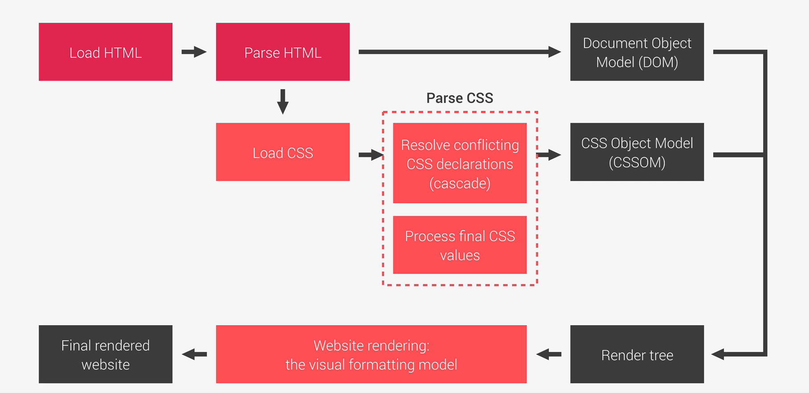
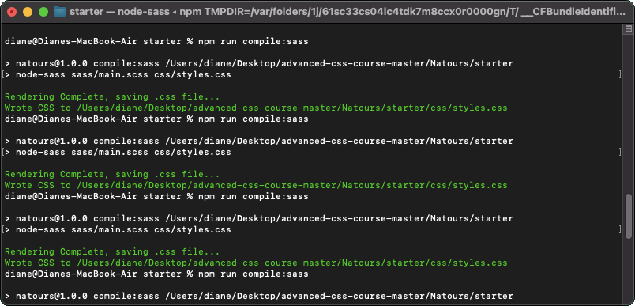
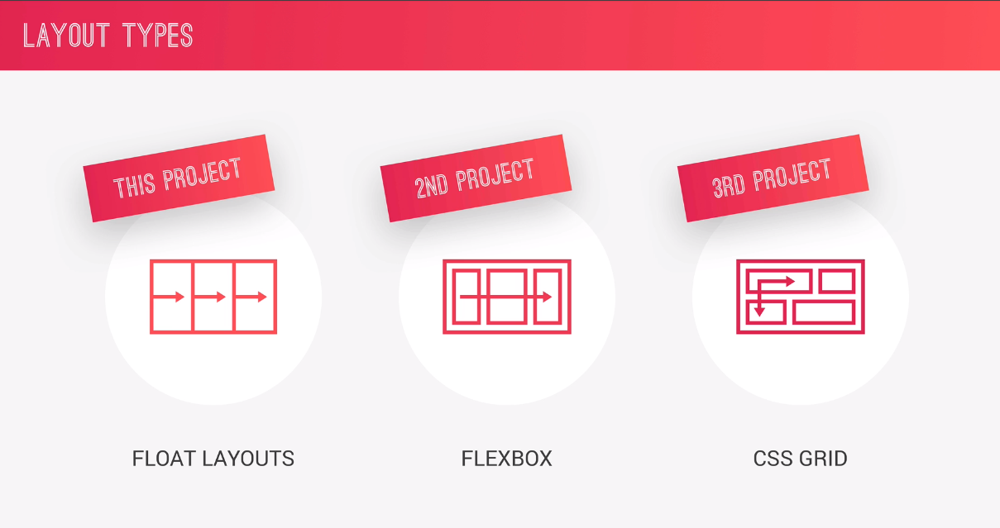
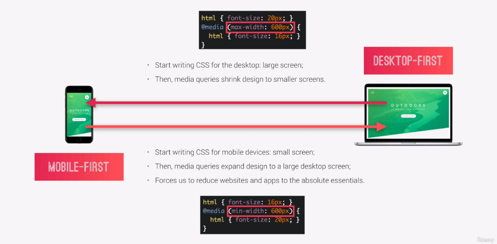
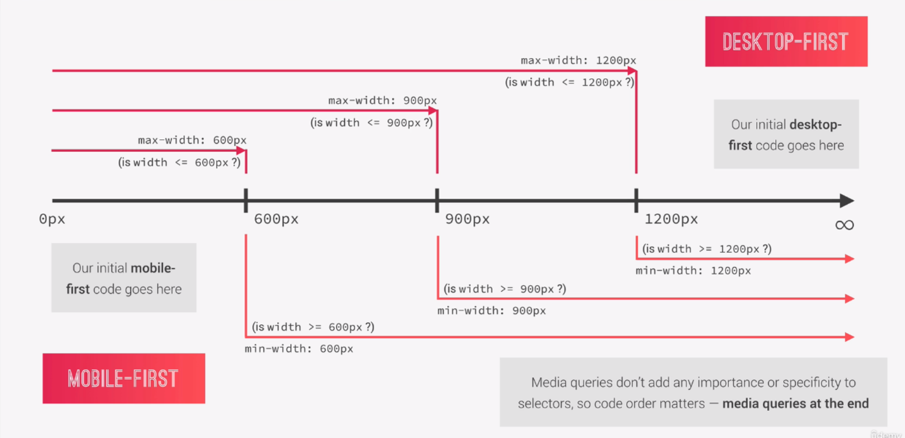
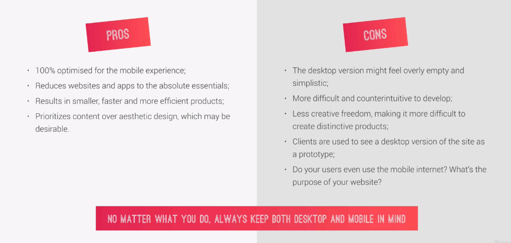
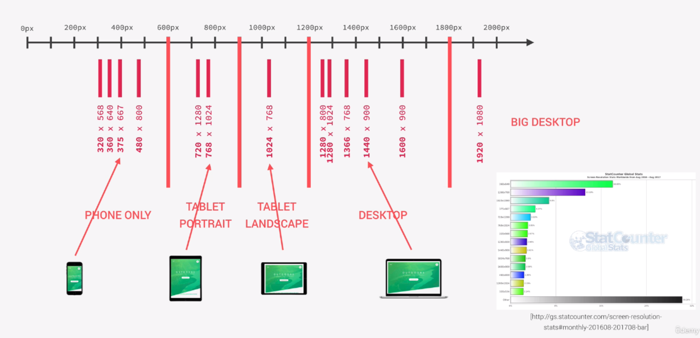
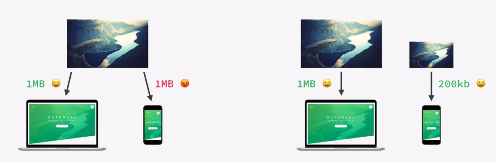
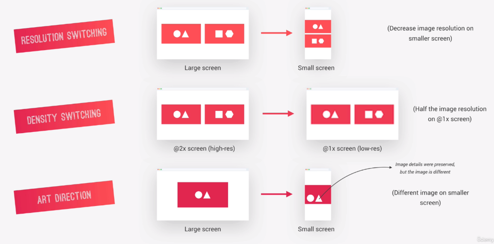

# Three Pillaras to write Good HTML and CSS... And Build Good Websites

## Responsive Design

- Fluid layouts
- media queries
- Responsive images
- Correct units
- Desktop-first vs mobile-first

## Maintainable and scalable code

- clean
- Easy-to-understand
- Growth
- Reausable
- How to organize files
- How to name classes
- How to structure HTML

## Web Performance

- Less HTTP request
- Less code
- Compress code
- Use a CSS presprocessor
- Less image
- Compress image

## What Happens to CSS When we load up a Webpage



## CSS TERMINOLOGY


## The Cascade ( The "C" in CSS)

> **Cascade** - Process of combining different stylesheets and resolving conflic between different CSS rules and declarations, When more than one rule applies to a certain elements.

| Important                     |        Specificity         | Source Order |
| :---------------------------- | :------------------------: | -----------: |
| User !important declaration   |        Inline style        |              |
| Author !important declaration |            IDs             |              |
| Author declaration            | Classes, pseudo, attribute |              |
| User declaration              |  Elements, pseudo-element  |              |
| Default browser declaration   |                            |              |

> **Source Order** - The last declaration in the code will overide all other declaration and will be applied.
> bkit da

## How CSS Values are Processed


## How Units are converted from relative to absolute (PX)

```
html, body {
  font-size: 16px;
  width: 80vw;
}
header {
  font-size: 150%:
  padding: 2em;
  margin-bottom: 10rem;
  height: 90vh;
  width: 1000px;
}
header-child {
  font-size: 3em;
  padding: 10%;
}
```

> **Example (x)**
>
> > %(fonts) - 150%
>
> > %(lengths) - 10%
>
> > em (fonts) - 3em
>
> > em (lengths) - 2em
>
> > vh - 90vh (viewport-hieght)
>
> > vw - 80vw (viewport-width)
>
> **How to convert to pixels**
>
> > %(fonts) - x% \* parent's computed font-size
>
> > %(lengths) - x% \* parent's computed **width**
>
> > em (fonts) - x \* **paerent** computed font-size
>
> > rem - x \* **root** computed font-size
>
> > vh - x \* **1%** of viewport heigh
>
> > vh - x \* **1%** of viewport width
>
> **Result pixels**
>
> > %(fonts) - 24px
>
> > %(lengths) - 100px
>
> > em (fonts) - 72px (3 \* 24)
>
> > em (lenghts) - 48px
>
> > rem - 160px
>
> > vh - **90%** of the current viewport heigh
>
> > vh - **80%** of the current viewport width

## **Inheritance: What you need to Know**

- Inheritance passes the values for some specific properties from parents to children - **more maintainable code;**
- Properties related to text are inherited: font-family, font-size,color,etc;
- The computed value of a property is what gets inherited, **not** the declared value.
- Inheritance of a property only works if no one declares a value for that property;
- The inherit keyword forces inheritance on a certain property;
- The initial keyword resets a property to its initial value.

## The Visual Formating Model

> Algorithm that calculates boxes and determines the layout of these boxes, for each element in the render tree, in order to determine the final layout of the page.

- **Dimension of boxes:** the box model;
- **Box type:** inline, block ang inline-block;
- **Positioning scheme:** floats and positioning;
- **Stacking contexts**;
- Other elements in the render tree;
- Viewport size, dimension of images, etc.

## **The Think - Build - Architect Mindset**

### **Think** : About the layout of your webpage or web app before writing code.

**Component-Driven Design**

- **Modular building block** that make up interfaces;
- Held together by **layout** of the page;
- **Re-usable** across a project, and between different project;
- **Independent,** allowing us to use theme anywhere on the page.

### **Build** : Your layout in HTML and CSS with a consistent structure for naming classes.

**BEM (Block Element Modifier)**

- **Block** Stand alone component that is maeningful on its own.
- **Element** : parts of a block that has no stand alone meaning.
- **Modifier** : a different version of a block or an element.

### **Architect** : Create a logical architecture for your CSS with files and folders.

**The 7-1 Pattern**

> 7 different folders for partial Sass files, and 1 main Sass file to import all other files into a compiled CSS stylesheet.

- base/
- components/
- layout/
- pages/
- themes/
- abstracts/
- vendors/

# SASS

> **Sass** is a **CSS processor**, an extension of CSS that adds power and elegance to the basic language.

### **Main SASS Features**

- **variables** : for reusable values such as colors, font-sizes, spacing, etc;
- **Nesting** : to nest selector inside of one another, allowing us to write less code;
- **Operators** : for mathematical operations rights inside of CSS;
- **Partials and imports** : to write CSS in different files and importing them all into one single file;
- **Mixins** : to write reusable of CSS code;
- **Functions** : similar to mixins, with the difference that they produce a value that can than be used;
- **Extend** : to make different selectors inherit declarations that are common to all of them;
- **Control directives** : for writing complex code using conditionals and loop(not covered in this course).

## This is the sample code using SASS(SCSS)

for the actual site here's the link https://codepen.io/Dhan022/pen/rNwxrdB?editors=1100

## Mixin

```
$color-primary: #f9ed69; //yellow color
$color-secondary: #f08a5d; //orange color
$color-tertiary: #b83b5e; //pink color
$color-text-dark: #333; //dark color
$color-text-light: #fff;

@mixin clearfix {
  &::after {
  content: "";
  clear: both;
  display: table;
  }
}

nav {
  margin: 30px;
  background-color: $color-primary;
  @include clearfix;
}
```

**@mixin** can use on **Multiple Place** throughout the page. The variable called **clearfix**. So its a mixin called clearfix. To work it we need to add **@include** and then the name of the mixin.

## Mixin with Argument.

```
 a:link {
  text-decoration: none;
  text-transform: uppercase;
  color: $color-text-dark: #333;
}

.btn-main:link,
.btn-hot:link {
  padding: 10px;
  display: inline-block;
  text-align: center;
  border-radius: 100px;
  width: $width-button;
  text-decoration: none;
  text-transform: uppercase;
  color: $color-text-light: #fff;
}
```

If you notice for the link, we have same text-decoration, text-transform and a color but the color actually different. So we need to do is to simply put these three lines of code into mixin in each declaration blocks.

Because we have a different color we use basically to pass it an argument,

```
@mixin style-link-text($col){
  text-decoration: none;
  text-transform: uppercase;
  color: $col;
}
```

So instead of repeating the code we have it one central place.This called **DRY PRINCIPLE** ("Dont Repeat Yourself").

```
a:link {
   @include style-link-text($color-text-dark);
}

.btn-main:link,
.btn-hot:link {
  padding: 10px;
  display: inline-block;
  text-align: center;
  border-radius: 100px;
  width: $width-button;
  @include style-link-text($color-text-light);
}
```

Basically this allows us to pass some information into this mixin and then the mixin can use that information. So these are the two use casses for mixins.

## Function

now imagine we just want a very simple function which simply divides the two arguments that we passed into the function.

```
@function devide($a, $b){
  @return $a / $b;
}
nav {
  margin: divide(60, 2) * 1px;
  background-color: $color-primary;
  @include clearfix;
}
```

if you can see 60/2 = 30 But the 30 doesn't have any unit. So CSS doesn't know what we mean like 30% or 30px. To fix it we need to multiplying it by a one pixel.

## Extends

```
.btn-placeholder {
  padding: 10px;
  display: inline-block;
  text-align: center;
  border-radius: 100px;
  width: $width-button;
  @include style-link-text($color-text-light);
}

.btn-main {
  &:link {
    @extend %btn-placeholder;
    background-color: $color-secondary;
  }

  &:hover {
    background-color: darken($color-secondary, 15%);
  }
}
.btn-hot {
  &:link {
    @extend %btn-placeholder;
    background-color: $color-tertiary;
  }

  &:hover {
    background-color: darken($color-tertiary, 10%);
  }
}
```

We just extended these two selector here, with the code that we have in placeholder.

# Install node-sass using terminal

```
npm install
npm install node-sass --save-dev
```

to compile the sass file. Go to the package.jason and change to this.
_(-w) mean watch_

```
"scripts": {
    "compile:sass": "node-sass sass/main.scss css/styles.css -w"
  },
```

then run to terminal

```
npm run compile:sass
```



> cmd + t : new line command / tab

Install live server to use for the all future project.
_you can add **sudo** if have an error espicially on mac user_

```
npm install live-server
```

> "&" : Means to copy the Selector

```
.header {
  height: 95vh;
  background-size: cover;
  background-position: top;
  position: relative;
  clip-path: polygon(0 0, 100% 0, 100% 75vh, 0 100%);

  &__logo-box{
  position: absolute;
  top: 40px;
  left: 40px;
  }
}
```

This is how you change, Instead to type **"header\_\_logo-box"** You can type **"&"** then the name of the selector.


## Basic Responsive Design Principle

1. **FLUID GRID AND LAYOUT** - To allow content to easily adapt to viewport width used to browse the website. Uses % rather than px for all layout-related lenghts.
2. **FLEXIBLE/RESPONSIVE IMAGES** - Images behave differently than text content, and so we need to ensure that they also adapt nicely to the current viewport.
3. **MEDIA QUERIES** - To change styles on certain viewport widths (breakpoints), allowing us to create different version of our website for different widths.

## Layout Types



>**&:not(:last-child)** : The meaning of this **not** is we put it on all the rows except the last child.
```
.row {
  max-width: $grid-width;
  background-color: #eee;
  margin: 0 auto;

  &:not(:last-child){
    margin-bottom: $gutter-vertical;
  }
}
```
This is sample value how to perfect divide all of into aparts.
```
width: calc((100% - #{$gutter-horizontal}) / 2);
```
it will select all elements in which the class attribute starts, **"^"** mean all the class attribute start with col-.
```
[class^="col-"]
```
>Resources Link For icon: *codingheroes.io/resources/*
>
>Resources Link For icon: *linea.io*
>
>Resources Link For color: *coolors.co*

To Run the file using Terminal. Go to the package.json file and see the name of you want to run file. 

>"scripts": {
    "compile:sass": "node-sass sass/main.scss css/styles.css -w"
  },

  the meaning of *-w* is watch. 

```
npm run compile:sass
```

# Responsive Design Strategies


## Resposive Design Strategies  **max-width** and **min-width**


* Maximun width at which media query still applies
>**max-width : 600px;**  ( is width <= 600px ? )
* Mininum width at which media query starts to apply
>**min-width : 600px;**  ( is width >= 600px ? )

## Is Mobile-First Right for You?

* We always need to consider the purposes of a website and align it with their user's needs. 
 
 ## Selecting our BreakPoints : A Good Approach
 
 This is the sample of screen size using breakpoints

 # What are the Responsive Images ?
 The goal of responsive images is to serve the **right image** to the **right screen size** and device , in order to avoid downloading unnecessary large images on smaller screens.

 

 ## When to use Responsive Images: The 3 use Cases
 

```

```
This Sample code of image. If the image use for a low resolution screen it will use "img/logo-green-1x.png 1x" and when a device has a high resolution screen, then it will use this image "img/logo-green-2x.png 2x". The source set attribute "**srcset**" we give the browser to choice to choose the best image for each situation.

```
<source srcset="img/logo-green-small-1x.png 1x, img/logo-green-small-2x.png 2x" 
              media="(max-width: 37.5em)">
```

This code can actually write a **media query** just like we do in CSS. And with this we force the browser to use image source set in case that **max width** is less than 600 pixels, and in case it's not, so if it's larger than 600 pixels then the browser is force to use this image source set.
 